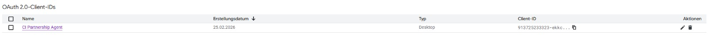
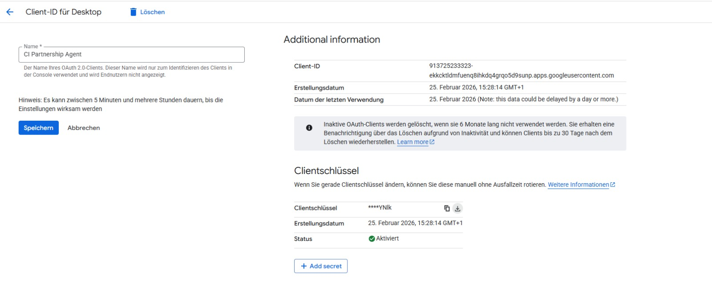

# Partnership Management Agent

AI-gestützter Outreach-Agent für das Partnership Management Ressort des [Collective Incubator e.V.](https://collective-incubator.de/)

Dieser Agent unterstützt bei der Akquise neuer Unternehmenspartner: Notion CRM Verwaltung, E-Mails verfassen, versenden und nachverfolgen mit [Open Code](https://opencode.ai/).

Das einrichten dauert ca. 25 Minuten und wird dir sehr viel mehr Zeit in der Zukunft sparen.

> [!IMPORTANT]
> Gmail unterstützt keinen zeitgesteuerten Versand über die API. E-Mails werden sofort gesendet. **Beste Sendezeit ist morgens zwischen 7:00 und 9:00 Uhr. (Siehe Notion)** Der Agent kann E-Mails als Draft erstellen, die du dann manuell über die Gmail-Website zeitgesteuert versendest.

## Beispiel Aufgaben für den Agent

```text
Schreibe eine Outreach-E-Mail an [Unternehmen]. Ansprechpartner ist [Name], [Position].
E-Mail: [adresse]. Nutze Template B (Sponsoring-Fokus).
```

```text
Sind heute Follow-Ups fällig für Unternehen denen ich als Ansprechpartner zugewiesen bin? Prüfe das CRM.
```

```text
Finde den richtigen Ansprechpartner bei [Unternehmen] für eine Partnerschaft.
Suche auf LinkedIn und im Web nach HR / Talent Acquisition.
```

```text
Schaue mal die neuste Email an die ich bekommen habe und aktualisiere den Status in Notion.
```

```text
Ist eine Partnerschaft mit [Unternehmen] ethisch vertretbar?
Schau mal auf LinkedIn / im Web was das Unternehmen macht und prüfe gegen die Ausschlussliste.
```

```text
Welche Notion Seiten sind hilfreich als CI Partnership Manager zu kennen?
```

---

## Voraussetzungen

Du brauchst folgende Tools. Weiter unten findest sind die Schritt für Schritt Installationsanleitungen für macOS und Windows.

| Tool | Zweck | Website |
|------|-------|---------|
| **Git** | Repository klonen | [git-scm.com](https://git-scm.com/) |
| **Bun** | JavaScript Runtime (MCP Credential Loading) | [bun.sh](https://bun.sh/) |
| **uv** | Python Package Manager (MCP Server) | [docs.astral.sh/uv](https://docs.astral.sh/uv/) |
| **Open Code** | AI-Agent CLI | [opencode.ai](https://opencode.ai/) |

---

## Setup

### 1. Tools installieren

<details>
<summary><strong>macOS</strong></summary>

Öffne das **Terminal:** `Cmd + Leertaste`, `Terminal` eintippen, Enter drücken. Alle Befehle unten dort eingeben.

#### Git

Prüfe ob Git installiert ist:

```bash
git --version
```

Falls nicht, installiere es über die Xcode Command Line Tools:

```bash
xcode-select --install
```

Folge den Anweisungen im Pop-up-Fenster. Nach der Installation Terminal neu starten und erneut prüfen.

#### Bun

```bash
curl -fsSL https://bun.sh/install | bash
```

Terminal neu starten, dann prüfen:

```bash
bun --version
```

#### uv

```bash
curl -LsSf https://astral.sh/uv/install.sh | sh
```

Terminal neu starten, dann prüfen:

```bash
uv --version
uvx --version
```

#### Playwright (Browser für LinkedIn MCP)

```bash
bun x playwright install chromium
```

#### LinkedIn MCP

```bash
uvx linkedin-scraper-mcp --login
```

Es dauert einen Moment bis sich das Browser-Fenster öffnet. Melde dich dort mit deinem LinkedIn-Account an.

#### Open Code

```bash
curl -fsSL https://opencode.ai/install | bash
```

Terminal neu starten, dann prüfen:

```bash
opencode --version
```

</details>

<details>
<summary><strong>Windows</strong></summary>

Alle Befehle werden in **Git Bash** eingegeben — nicht in cmd oder PowerShell.

**So öffnest du Git Bash:** `Windows-Taste` drücken → `Git Bash` eintippen → Enter.

> **⚠️ Wichtig:** In Git Bash funktionieren `Strg+C` und `Strg+V` **nicht** wie gewohnt. `Strg+C` beendet den laufenden Prozess, `Strg+V` fügt nichts ein. Zum **Kopieren und Einfügen** immer **Rechtsklick → Copy / Paste** verwenden.

#### Git

Prüfe ob Git bereits installiert ist: `Windows-Taste` drücken, `Git Bash` eintippen. Wenn es in der Suche erscheint, ist Git installiert — öffne es. Falls nicht:

1. Lade Git herunter: [git-scm.com/download/win](https://git-scm.com/download/win)
2. Führe den Installer aus — alle Standardeinstellungen beibehalten
3. Öffne **Git Bash** (`Windows-Taste` → `Git Bash` → Enter)

#### Bun

```bash
curl -fsSL https://bun.sh/install | bash
```

Danach Bun zum PATH hinzufügen — kopiere diese beiden Zeilen und füge sie in Git Bash ein (Rechtsklick → Paste):

```bash
echo 'export BUN_INSTALL="$HOME/.bun"' >> ~/.bash_profile
echo 'export PATH="$BUN_INSTALL/bin:$PATH"' >> ~/.bash_profile
```

Neues Git Bash Fenster öffnen (`Windows-Taste` → `Git Bash` → Enter), dann prüfen:

```bash
bun --version
```

#### uv

```bash
curl -LsSf https://astral.sh/uv/install.sh | sh
```

Danach uv zum PATH hinzufügen:

```bash
echo 'source $HOME/.local/bin/env' >> ~/.bash_profile
```

Neues Git Bash Fenster öffnen (`Windows-Taste` → `Git Bash` → Enter), dann prüfen:

```bash
uv --version
uvx --version
```

#### Playwright (Browser für LinkedIn MCP)

```bash
bun x playwright install chromium
```

#### LinkedIn MCP

```bash
uvx linkedin-scraper-mcp --login
```

Es dauert einen Moment bis sich das Browser-Fenster öffnet. Melde dich dort mit deinem LinkedIn-Account an.

#### Open Code

```bash
curl -fsSL https://opencode.ai/install | bash
```

Danach Open Code zum PATH hinzufügen:

```bash
echo 'export PATH="$HOME/.opencode/bin:$PATH"' >> ~/.bash_profile
```

Neues Git Bash Fenster öffnen (`Windows-Taste` → `Git Bash` → Enter), dann prüfen:

```bash
opencode --version
```

</details>

### 2. Repository klonen

Wechsle zuerst in den Ordner, in dem das Projekt gespeichert werden soll (z.B. Dokumente). **Windows:** Tippe `cd ` (mit Leerzeichen), ziehe den gewünschten Ordner aus dem Explorer ins Git Bash Fenster und drücke Enter.

```bash
git clone https://github.com/stickerdaniel/partnership-management-agent.git
cd partnership-management-agent
```

### 3. Google Cloud Projekt einrichten

Du brauchst OAuth-Zugangsdaten um E-Mails über die Gmail API zu senden.

<details>
<summary><strong>3a. Google Cloud Projekt erstellen</strong></summary>

1. Öffne [console.cloud.google.com](https://console.cloud.google.com/)
2. Melde dich mit deinem `@collective-incubator.de` Google Account an
3. Klicke oben auf das Projekt-Dropdown → **Neues Projekt**
4. Name: `CI Partnership Agent` (oder beliebig)
5. Klicke **Erstellen**

</details>

<details>
<summary><strong>3b. APIs aktivieren</strong></summary>

Öffne jeweils den Link, stelle sicher, dass der richtige Google Account aktiviert ist und klicke auf **Aktivieren/Enable:**

- [Gmail API](https://console.cloud.google.com/apis/library/gmail.googleapis.com)
- [Google Drive API](https://console.cloud.google.com/apis/library/drive.googleapis.com)
- [Google Calendar API](https://console.cloud.google.com/apis/library/calendar-json.googleapis.com)
- [Google Docs API](https://console.cloud.google.com/apis/library/docs.googleapis.com)
- [Google Sheets API](https://console.cloud.google.com/apis/library/sheets.googleapis.com)
- [Google Slides API](https://console.cloud.google.com/apis/library/slides.googleapis.com)
- [Google Forms API](https://console.cloud.google.com/apis/library/forms.googleapis.com)
- [Google Tasks API](https://console.cloud.google.com/apis/library/tasks.googleapis.com)
- [Google Chat API](https://console.cloud.google.com/apis/library/chat.googleapis.com)
- [People API](https://console.cloud.google.com/apis/library/people.googleapis.com)
- [Apps Script API](https://console.cloud.google.com/apis/library/script.googleapis.com)

</details>

<details>
<summary><strong>3c. OAuth Consent Screen konfigurieren</strong></summary>

1. Gehe zu [APIs & Services → OAuth Consent Screen](https://console.cloud.google.com/apis/credentials/consent)
2. Wähle **Extern** und klicke **Erstellen**
3. Fülle aus:
   - App-Name: `CI Partnership Agent`
   - Support-E-Mail: deine `@collective-incubator.de` Adresse
   - Alle anderen Felder können leer bleiben
4. Klicke **Speichern und fortfahren** durch die weiteren Schritte
5. Unter **Testnutzer** → klicke **+ Add Users** und füge deine `@collective-incubator.de` Adresse hinzu
6. **Speichern und fortfahren** bis zum Ende

</details>

<details>
<summary><strong>3d. OAuth Client ID erstellen</strong></summary>

1. Gehe zu [APIs & Services → OAuth Consent Screen](https://console.cloud.google.com/apis/credentials/consent) und klicke rechts auf **+ Create OAuth Client ID**
2. Anwendungstyp: **Desktopanwendung**
3. Name: `CI Partnership Agent`
4. Klicke **Erstellen**
5. Klicke **JSON herunterladen**. Falls der Download nicht funktioniert (Google ist buggy): Klicke auf das **Stift-Icon** (✏️) neben dem Eintrag unter „OAuth 2.0-Client-IDs" und dann auf den kleinen **Download-Button** (⬇️)

   
   

6. Finde die heruntergeladene Datei (heißt `client_secret_...json`) im Downloads-Ordner
7. Benenne sie um in **`google-credentials.json`**
8. Verschiebe sie in den `partnership-management-agent` Projektordner (dort wo auch die `README.md` liegt)

> **Wichtig:** Diese Datei enthält deine Zugangsdaten. Sie ist per `.gitignore` vom Repository ausgeschlossen und darf **niemals** committed (hochgeladen) werden.

</details>

### 4. Dich als CI Partnership Manager konfigurieren

Schreibe dem Agent eine beliebige Nachricht (z.B. „Hallo"). Beim ersten Mal fragt er dich automatisch nach deinem Namen, deiner Rolle, E-Mail, Telefonnummer und Gmail-Signatur. Du musst nichts manuell konfigurieren — beantworte einfach seine Fragen.

### 5. Open Code

Du musst dich bei Opencode mit einem Provider einloggen.Claude-Modelle kannst du über eine Claude Subscription oder kostenlos über Github Pro und Antigravity nutzen. Wenn du GPT-Modelle nutzen willst, verbindest du am einfachsten OpenAI. Gib dafür folgenden Befehl in Open Code ein:

```bash
opencode auth login
```

Wähle `google` -> `OAuth with Google (Antigravity)` -> `Add account`
- Melde dich mit deiner `@collective-incubator.de` Adresse an
- Project ID ignorieren, Enter drücken und einloggen

Opencode starten mit:

```bash
opencode
```

Oder als Web-Oberfläche im Browser (einfacher zu bedienen):

```bash
opencode web
```

> **Tipp:** Mit `Strg+C` (macOS: `Ctrl+C`) kannst du den Agent im Terminal jederzeit beenden.

#### Modellauswahl

Mit `/models` kannst du das KI-Modell auswählen. Empfohlene Modelle:

- **Claude Sonnet 4.6** — schnell und gut für die meisten Aufgaben
- **Claude Opus 4.6** — schlauer, aber verbraucht Limits schneller. Lohnt sich für komplexere Aufgaben.
- Falls du lieber ChatGPT-Modelle nutzen willst: **GPT 5.4** verwenden. Manche Codex modelle können keine Bilder lesen und sind speziell fürs Programmieren.

#### Nützliche Shortcuts

- **Tab** — wechselt zwischen Plan-Modus und Code-Modus. Der Plan-Modus eignet sich gut, um bei komplexeren Aufgaben erstmal eine Abfolge von Schritten zu definieren, bevor der Agent loslegt.
- **Strg+T** (macOS: `Ctrl+T`) — passt das Reasoning-Level des Modells an. Mehr Reasoning = bessere Ergebnisse bei komplexen Aufgaben, aber langsamer. Weniger Reasoning = schnellere Antworten bei einfachen Aufgaben.

#### Mehr Tokens bekommen

Bei Gelegenheit kannst du deine Studienbescheinigung [hier einreichen](https://github.com/education) um Github Pro zu bekommen. Verbinde Github als Provider in Opencode mit `/connect` um mehr Zugriff auf die besten Modelle zu bekommen. Es gibt ein monatliches Limit.

Beim ersten Start wirst du aufgefordert, dich über den Browser bei Google/Notion zu authentifizieren. Melde dich mit deiner `@collective-incubator.de` Adresse an und erteile die Berechtigungen.

Wenn alles richtig eingestellt ist, solltest du 3 MCPs mit status `Enabled` sehen wenn du folgenden Befehl in Open Code eingibst:

```bash
/mcps
```

### 6. Workspace MCP Testen

Schreibe in Open Code:

```text
Suche meine letzten 3 E-Mails
```

Wenn du eine Antwort die deine neusten 3 CI Mails zusammenfasst bekommst, funktioniert alles.

### Werde Power User

Als ich angefangen habe viel mit Agents zu arbeiten war meine Tippgeschwindigkeit was mich abgebremst hat. Dazu ist eher dazu geneigt, dem Agent genauere Anweisungen zu geben, und detailiert zu beschreiben was man möchte, wenn man nicht alles tippen muss.

Hier sind ein paar gute Speech-to-Text-Tools:

- Bezahlt, am besten (kostenlos 2000 Wörter / Woche): [Wispr Flow](https://wisprflow.ai/r?DANIEL92159)
- Kostenlos für MacOS: [Hex](https://hex.kitlangton.com/)

---

## Wichtige Links

| Ressource | Link |
|-----------|------|
| Notion — PM Ressort | [Öffnen](https://www.notion.so/cc4f64035fb645918a8326cf3ac2ba68) |
| Notion — CRM | [Öffnen](https://www.notion.so/30e3a7d9fa538099993fef633bec341e) |
| Notion — Outreach Templates | [Öffnen](https://www.notion.so/2b73a7d9fa53803bac75d37da62b5746) |
| Drive — Outreach 2026 | [Öffnen](https://drive.google.com/drive/folders/1tXsDbqqa6mA6YNYWPzZ1OT908foaXLJj) |
| Drive — Offering | [Öffnen](https://drive.google.com/drive/folders/1_HI9RtcVQ08teAWCSqUp2mfhoRvhkmRn) |

---

## Projektstruktur

```text
partnership-management-agent/
├── google-credentials.json      ← Deine OAuth-Zugangsdaten (gitignored)
├── userconfig.jsonc             ← Deine persönliche Konfiguration (gitignored)
├── userconfig.jsonc.example     ← Vorlage für userconfig.jsonc
├── .gitignore
├── .mcp.json                    ← MCP-Server Konfiguration (Claude Code)
├── opencode.jsonc               ← MCP + Modell Konfiguration (Open Code)
├── AGENTS.md                    ← Agent-Anweisungen (Outreach-Regeln, Templates, CRM)
├── CLAUDE.md → AGENTS.md        ← Symlink (Claude Code Kompatibilität)
└── README.md                    ← Diese Datei
```

---

## Kontakt

Bei Fragen zum Agent wende dich an Daniel [dsticker@collective-incubator.de](mailto:dsticker@collective-incubator.de)
/ IT-Ressort: [it@collective-incubator.de](mailto:it@collective-incubator.de)
